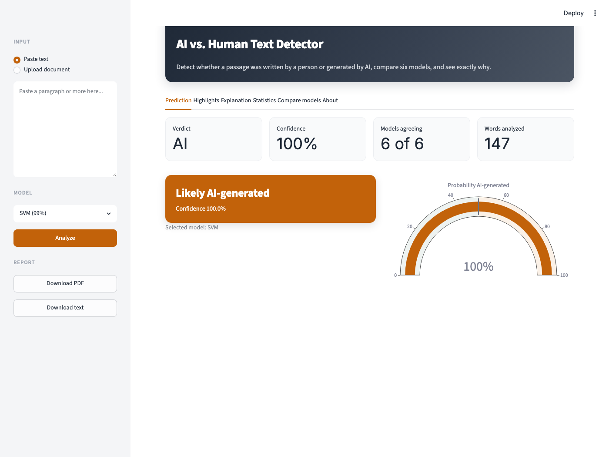
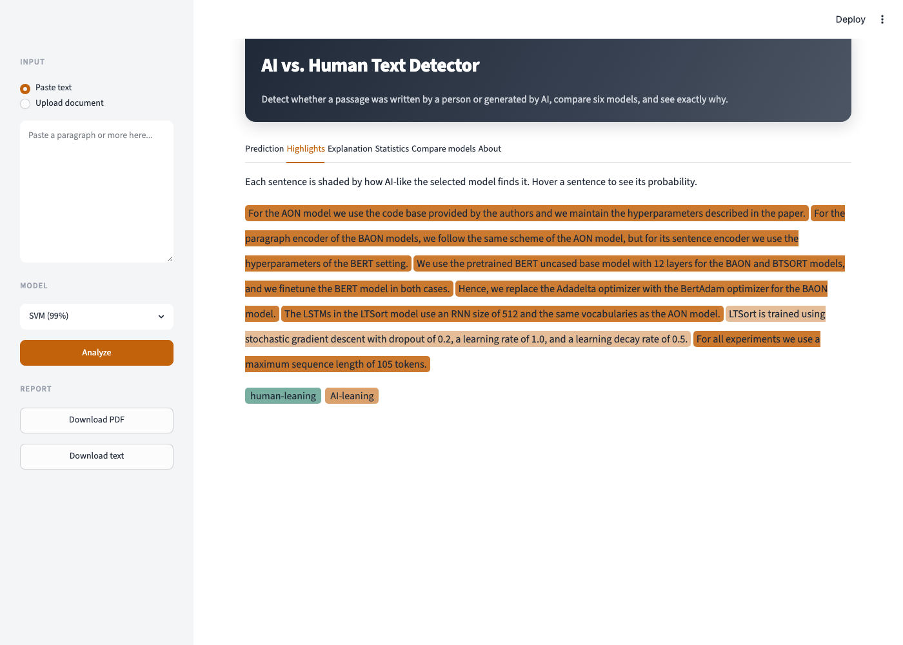
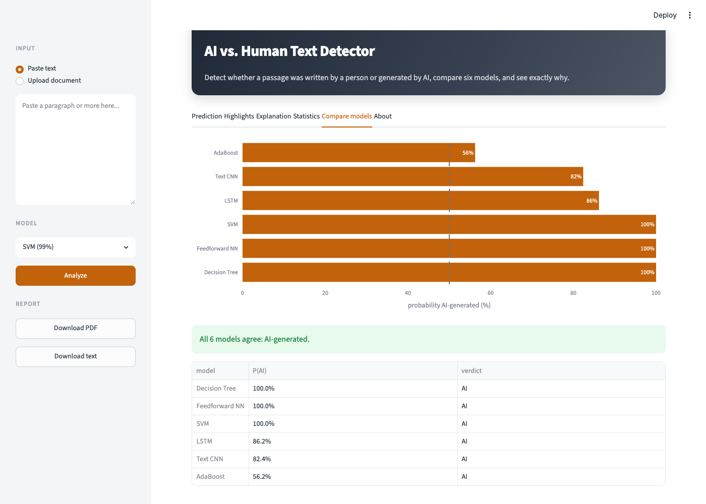

# AI vs. Human Text Detection

A text classifier that decides whether a passage was written by a person or
generated by AI. It trains and compares six models (three traditional machine
learning, three deep learning) and serves them through a Streamlit web app that
accepts a PDF, Word document, or pasted text and returns a prediction with a
calibrated confidence score and an explanation of why.

Built for *Intro to Large Language Models*, Summer I 2026.



## Results

Held-out test set (1,226 passages the models never saw during training or tuning):

| Model           | Accuracy | Precision | Recall |   F1  |  AUC  |
|-----------------|:--------:|:---------:|:------:|:-----:|:-----:|
| Feedforward NN  |  0.989   |   0.990   | 0.987  | 0.989 | 0.999 |
| SVM             |  0.985   |   0.993   | 0.977  | 0.985 | 0.999 |
| AdaBoost        |  0.972   |   0.975   | 0.967  | 0.971 | 0.996 |
| Decision Tree   |  0.887   |   0.902   | 0.868  | 0.885 | 0.951 |
| LSTM            |  0.882   |   0.851   | 0.925  | 0.887 | 0.924 |
| Text CNN        |  0.789   |   0.793   | 0.781  | 0.787 | 0.879 |

The app uses the **SVM** by default: it is within a fraction of a percent of the
best accuracy, returns calibrated probabilities, trains in seconds, and its
linear weights make per-word explanations possible.

## The web app

Paste text or upload a PDF or Word file, pick any of the six models, and get a
verdict with calibrated confidence. Beyond a single number, the app shows a
sentence-level heatmap of which parts read as AI, a word-level explanation, text
statistics, and a side-by-side comparison of all six models.

Sentence-level highlighting (red leans AI, green leans human):



Side-by-side model comparison, with an agreement summary:



## Quick start (under 10 minutes)

```bash
cd ai_human_detection_project
python3 -m venv .venv
source .venv/bin/activate
pip install -r requirements.txt
python -m nltk.downloader punkt punkt_tab stopwords wordnet
```

Run the web app (the trained models are included, so this works immediately):

```bash
streamlit run app.py
```

Open the notebook to see the full analysis. To retrain the models, first place
the labeled dataset at `data/training_data/train_data_with_labels.xlsx`, then:

```bash
jupyter lab notebooks/project1_notebook.ipynb
```

A rendered, read-only copy of the notebook is at
[docs/project1_notebook.html](docs/project1_notebook.html) — open it in any
browser to see every chart and result without running anything.

## Project layout

```
ai_human_detection_project/
├── app.py                      # Streamlit web application
├── requirements.txt
├── README.md
├── models/                     # trained models, vectorizer, sequence vocabulary
├── data/
│   └── training_data/          # place the labeled dataset here to retrain
├── notebooks/
│   └── project1_notebook.ipynb # data exploration, features, training, evaluation
├── src/                        # shared code used by both notebook and app
│   ├── preprocessing.py        # loading and text cleaning
│   ├── features.py             # linguistic features
│   ├── inference.py            # load models, predict
│   ├── explain.py              # prediction explanations
│   ├── extract.py              # PDF/Word/text extraction
│   └── report.py               # downloadable report
├── docs/                       # rendered notebook
└── reports/                    # generated metrics and reports
```

The notebook and the app import the same code from `src/`, so the model logic
they use is guaranteed identical.

## Dataset

The labeled dataset (`train_data_with_labels.xlsx`) is not bundled here. It is
8,176 passages with columns `text` and `label` (`0` human, `1` AI); after
removing duplicates and repairing character-encoding damage, 8,169 remain,
balanced almost exactly 50/50. The app runs on the included trained models
without it; place the file in `data/training_data/` only if you want to retrain.

## Design decisions

**Stopwords and punctuation are kept, not removed.** Distinguishing human from
AI writing is a stylometry problem (telling writing styles apart), not topic
classification. Function words and punctuation habits are among the strongest,
most topic-independent signals, so removing them would discard the evidence. This
is the same principle behind classic authorship attribution.

**Encoding is repaired at load time.** The raw data is full of double-encoded
smart quotes (for example `don’t` for `don't`). Left alone these become garbage
tokens and an artifact the classifier could exploit, so `ftfy` repairs them
before anything else.

**Length is treated carefully.** AI passages are capped near 400 words while
human passages run longer. To confirm the models learned style rather than this
artifact, the notebook shows that a length-only baseline scores near chance
(about 52%) while the best model stays at 98.8% accuracy on length-matched text.

**Confidence is honest.** The SVM is calibrated so its probabilities are
meaningful; the app says "borderline" near 50% and surfaces model disagreement
rather than presenting a single number as proof.

**Three feature representations are compared.** TF-IDF, Word2Vec embeddings, and
handcrafted linguistic features. TF-IDF separated the classes best (about 98% vs.
88% for Word2Vec and 71% for the linguistic features with a simple classifier),
which is why the traditional models are trained on it.

## How each model was tuned

Traditional models were tuned with `GridSearchCV` (5-fold cross-validation) on
TF-IDF features. Deep models used fixed seeds, dropout, and early stopping.

| Model           | Tuned over                                              | Selected setting                          |
|-----------------|---------------------------------------------------------|-------------------------------------------|
| SVM             | `C`, loss (linear SVM)                                   | `C=5`, hinge loss, calibrated (sigmoid)   |
| Decision Tree   | criterion, max depth, min samples per leaf               | entropy, depth 50, leaf 20                |
| AdaBoost        | n_estimators, learning rate, stump depth                 | 200 estimators, lr 1.0, stump depth 2     |
| Feedforward NN  | dense MLP on TF-IDF, dropout 0.5, early stopping          | 256 -> 64 -> 1                            |
| LSTM            | bidirectional LSTM on token sequences                    | embedding 128, LSTM 64, dropout 0.5       |
| Text CNN        | parallel convolutions (Kim, 2014)                        | filters {3,4,5} x 100, dropout 0.5        |

The deep models did not beat the traditional ones at this data scale, which is
expected: LSTMs and CNNs learn word meaning and order from scratch and need far
more than ~5,700 training passages to do so well. The notebook reports this
rather than hiding it.

## Limitations

Automated AI-text detection is probabilistic and can be wrong. Published work
shows detectors are biased against non-native English writers, are easily evaded
by paraphrasing, and degrade on text from models they were not trained on. These
classifiers separate this dataset well; they are a signal, not proof.

## Requirements

Python 3.12. All dependencies are pinned in `requirements.txt` (scikit-learn,
TensorFlow/Keras, gensim, NLTK, Streamlit, and supporting libraries).
